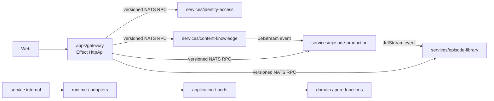
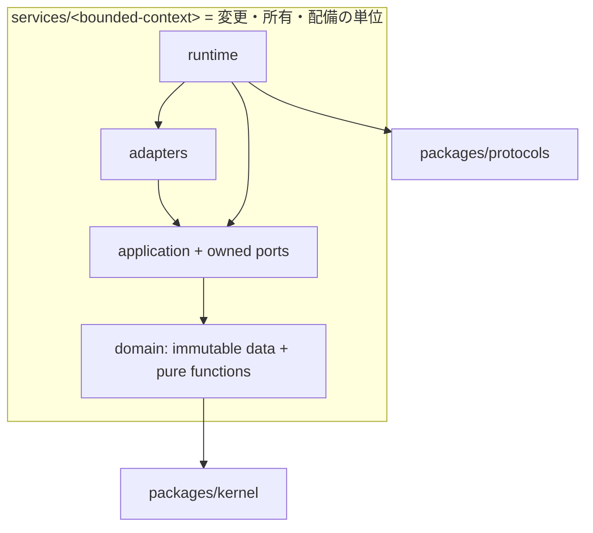
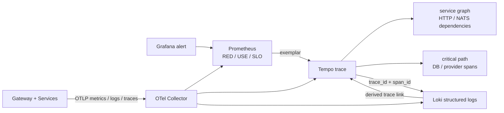
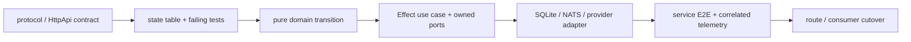

# 関数型DDDマイクロサービス移行ガイド

- 更新日: 2026-08-12
- 状態: 移行中
- 対象判断: 新旧どちらへ実装するか、旧実装をいつ削除できるか
- 関連: [システムアーキテクチャ](architecture.md) / [開発ガイド](development.md) / [ADR-0032](adr/0032-grafana-correlated-observability.md) / [ADR-0033](adr/0033-colocate-bounded-context-with-service.md) / [ADR-0034](adr/0034-functional-domain-model-and-effect-boundaries.md)

> 関数型DDDの基盤と各Contextの縦断スライスは実装済みだが、機能移植は完了していない。現在の`docker compose`で動く正本は旧`apps/api` / `apps/worker`であり、新系は機能同等性と運用受け入れを満たすまで併存する。

## 1. 移行の正本と依存方向

新規の業務実装は`services/*`、外部HTTP契約は`apps/gateway`、Context間契約は`packages/protocols`へ追加する。旧`apps/api`、`apps/worker`、`packages/domain|application|adapters`へ新規機能を増やさない。

依存の矢印は必ず内向きにする。外部入力は`unknown`として境界でparseし、余剰propertyを拒否したdeep-frozenな値だけをapplication/domainへ渡す。Context間でdomain型やDBを共有しない。

## 2. `contexts/`と`services/`を分離しない理由

4 Bounded Contextと配備サービスが現在は1対1であるため、純粋中核だけを`contexts/`へ分けると、1変更の所有範囲が2つのtop-level treeへ分散する。Onionの境界は物理的な遠さではなく、service内の構造とCIで保証する。

`contexts/`分離を再検討するのは、同じdomain/applicationを2つ以上の独立配備が共有することが確定した場合だけとする。偶然似た型や関数は共有理由にしない。

## 3. 現在地

### 完成済みの移行基盤

| Surface | 実装済みの範囲 | 証拠 |
| --- | --- | --- |
| immutable kernel | strict parse、全エラー収集、循環安全なdeep freeze | `packages/kernel` |
| Context間protocol | version付きsubject/envelope、Actor、correlation/causation、W3C trace context | `packages/protocols` |
| 4 Contextの縦断スライス | 関数型domain/application port、境界parse、SQLite/NATS adapterの代表経路 | `services/*` |
| Gatewayの縦断スライス | Effect HttpApi契約、handler、NATS port | `apps/gateway` |
| Architecture gate | 逆向きimport、Context横断import、新規自己定義classをCIで拒否 | `scripts/check-architecture.mjs` |
| Observability基盤 | OTel、Grafana、Prometheus、Loki、Tempo、Collector、5 dashboard、7 alert | `packages/observability`、`infra/observability` |

「縦断スライス完了」は、そのContextの全ユースケース移植完了を意味しない。

### 未移植・未接続

| 優先度 | 未完了 | 完了の判定 |
| --- | --- | --- |
| P0 | 4サービスすべての実行entrypoint、NATS接続、health/readiness、Compose配備 | clean environmentでGateway + 4 servicesを起動し、停止・再接続を含むsmokeが通る |
| P0 | 認証、購読/RSS/archive、生成pipeline、ライブラリ/音声アクセスの機能同等性 | owner scope・冪等性・再試行を含む状態遷移表とservice間E2Eが通る |
| P0 | 新4サービスのOTel実配線 | 1リクエストをmetrics → exemplar → trace → logs → service graphで追跡できる |
| P1 | Gateway OpenAPIの生成物とWeb client切替 | contract diffがcleanでWebの主要E2Eが新Gatewayだけで通る |
| P1 | service別migration/backup/restore | 各serviceが所有DBを空状態から作成し、backup/restore試験が通る |
| P1 | provider、Object Store、scheduler、Agent harnessの移植 | 旧Workerを使わずfake/liveの受け入れ条件を満たす |
| P2 | Cloud runtimeの扱い | 継続か廃止を決定し、選択したruntimeのcontract testが通る |

細かなロジックを先回りして移すより、P0の配備・契約・相関監視を先に閉じ、以降はContextごとの縦断ユースケース単位で移植する。

## 4. Grafanaでの障害切り分け

OpenTelemetryを計装と転送の唯一の契約として維持し、保存・検索だけをPrometheus/Loki/Tempoへ分離する。Grafanaのprovisioning fileがdashboard、datasource相関、alertの正本である。

調査は次の順に行う。

1. `Overview`または`Episode Production`でerror rate、latency、queue ageを特定する。
2. exemplarまたは`Service Map & Tracing`から代表traceを開き、失敗edgeとcritical pathを特定する。
3. Tempoのtrace-to-logsから同じ`trace_id`、必要なら`span_id`のログへ絞る。
4. `Telemetry Platform`でCollector queue/export failureを確認し、観測欠落と業務障害を分離する。
5. Grafana自体が見えない場合は、独立watchdogのSMTP通知と各health endpointを確認する。

バックエンドtraceは100%収集し、metricsへ高cardinality IDを入れない。message/job IDはtrace/logだけに置き、認証情報、本文、完全URL、DB statementは送信前にredactする。

## 5. 移植の進め方

1ユースケースを次の単位で完結させてから次へ進む。

- bug修正は再現testを先に追加する。
- mutable SDK interopは`infrastructure/unsafe`に閉じ、parse直後にimmutable値へ変換する。
- protocol変更は後方互換または新versionを選び、producer/consumerを同時変更前提にしない。
- dashboard/alertもユースケースの受け入れ条件として同じ変更で更新する。

## 6. 旧実装の削除条件

旧`apps/api` / `apps/worker`と`packages/domain|application|adapters`は、次をすべて満たした後にだけ削除する。

- 全公開routeと非同期flowが新Gateway/4 servicesだけでE2E Green。
- 所有者分離、冪等性、lease/retry、outbox/inbox、署名URLの状態遷移表がGreen。
- Webが新Gateway生成clientだけを使い、旧OpenAPIへの参照がゼロ。
- clean databaseからmigrationし、既存dataの移行とrollback、backup/restoreを実証。
- synthetic journeyをGrafanaでmetrics、trace、logs、service graphまで往復可能。
- 旧packageへのruntime/import/Compose参照が`rg`とarchitecture testでゼロ。
- 1 releaseの並行比較で重大な機能差とSLO退行がなく、rollback手順を演習済み。

削除はContext単位ではなく、参照が閉じた配備単位で行う。条件未達の項目を「実装済み」と読み替えて削除を急がない。
