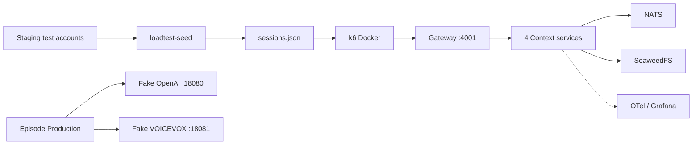

# 負荷テストとProvider Chaos

ステージング相当のGateway、4 Context services、NATS、SeaweedFSに対して、k6でAPI負荷と非同期番組生成負荷を流す。OpenAIとVOICEVOXはloadtest専用Fake Providerへ差し替える。



## 安全条件

- 本番環境へ実行しない。
- OpenAI実サービスと実VOICEVOXを使用しない。
- cookieファイル、session fixture、結果JSONはGitへ追加しない。
- Fake Providerのprovider endpointはloadtestネットワーク内だけで使い、control endpointは管理tokenなしでは操作できない。
- `LOADTEST_FAKE_CONTROL_TOKEN`は試験専用の短命secretとし、Fake Provider以外のserviceへ渡さない。
- ステージングのテストアカウントcookieは短期発行し、試験後に失効させる。

## 起動

作業ディレクトリはリポジトリrootとする。通常のローカルstackとloadtest overrideを同じCompose projectで起動する。

```bash
export LOADTEST_FAKE_CONTROL_TOKEN="$(openssl rand -hex 32)"
pnpm loadtest:up
curl --fail http://127.0.0.1:4001/health
curl --fail http://127.0.0.1:18080/health
curl --fail http://127.0.0.1:18081/health
```

`infra/loadtest/compose.yaml`はEpisode Productionのprovider endpointだけをFake Providerへ差し替える。実VOICEVOX containerが依存関係上起動しても、Productionからのリクエスト先はfake endpointである。

停止時はvolumeを削除しない。

```bash
pnpm loadtest:down
```

## Session fixture

入力cookieは、パスワードやsecretを含まないローカルファイルへ保存する。owner間分離試験を有効にするため、各entryに実際のBetter Auth user IDを指定する。

```json
[
  { "cookie": "better-auth.session_token=...", "ownerId": "test-owner-001" },
  { "cookie": "better-auth.session_token=...", "ownerId": "test-owner-002" }
]
```

既存テストアカウントごとの記事・フィードIDをGatewayから取得し、k6用fixtureを作る。

```bash
LOADTEST_BASE_URL=http://127.0.0.1:4001 \
LOADTEST_COOKIES_FILE=/secure/path/staging-cookies.json \
pnpm loadtest:seed -- \
  --input /secure/path/staging-cookies.json \
  --output /tmp/news-podcast-loadtest/sessions.json \
  --minimum-articles 20
```

出力fixtureは各sessionのcookie、owner ID、article/job/episode/feed IDsを含み、`0600`で保存される。100ユーザー分のfixtureが必要なcapacity試験では、入力cookieも100件にする。seedはowner IDがない入力を拒否する。

各シナリオは一定割合で、owner Aのarticle/job/episode/audio IDをowner Bのcookieで参照する。403または404以外をowner間データ混線として記録し、capacity/chaosではowner isolation probeが1件以上ない場合も不合格とする。

## 実行モード


### Smoke

```bash
LOADTEST_BASE_URL=http://127.0.0.1:4001 \
LOADTEST_SESSIONS_FILE=/tmp/news-podcast-loadtest/sessions.json \
pnpm loadtest:smoke
```

### Capacity

API負荷とjob受付を段階的に増やし、最初に合格基準を外れた段階で停止する。

```bash
LOADTEST_BASE_URL=http://127.0.0.1:4001 \
LOADTEST_SESSIONS_FILE=/tmp/news-podcast-loadtest/sessions.json \
pnpm loadtest:capacity
```

初期段階は次の通り。

| 段階 | API | job受付 | 継続時間 |
|---|---:|---:|---:|
| ramp-2 | 2 RPS | 0.1 jobs/sec | 180秒 |
| ramp-5 | 5 RPS | 0.25 jobs/sec | 180秒 |
| ramp-10 | 10 RPS | 0.5 jobs/sec | 180秒 |
| ramp-20 | 20 RPS | 1 jobs/sec | 180秒 |
| ramp-40 | 40 RPS | 1 jobs/sec | 180秒 |

`LOADTEST_STAGE_DURATION`で段階時間を短縮できる。短縮値はpreflight専用とし、capacity結果の正式記録には使わない。

### Soak / Spike

capacityで合格した最終段階のAPI/job rateを環境変数へ設定してから、専用modeを実行する。`soak`は既定10分、`spike`は既定1分かつ2倍負荷である。runnerは各modeのthresholdを評価し、失敗時はexit code 1を返す。

```bash
LOADTEST_BASE_URL=http://127.0.0.1:4001 \
LOADTEST_SESSIONS_FILE=/tmp/news-podcast-loadtest/sessions.json \
LOADTEST_API_RATE=20 \
LOADTEST_JOB_RATE=1 \
pnpm loadtest:soak

LOADTEST_BASE_URL=http://127.0.0.1:4001 \
LOADTEST_SESSIONS_FILE=/tmp/news-podcast-loadtest/sessions.json \
LOADTEST_API_RATE=20 \
LOADTEST_JOB_RATE=1 \
LOADTEST_SPIKE_FACTOR=2 \
pnpm loadtest:spike
```

### Provider Chaos

```bash
LOADTEST_BASE_URL=http://127.0.0.1:4001 \
LOADTEST_SESSIONS_FILE=/tmp/news-podcast-loadtest/sessions.json \
LOADTEST_API_RATE=2 \
LOADTEST_JOB_RATE=0.1 \
pnpm loadtest:chaos
```

次の順にFake Provider profileを切り替える。

```text
slow → timeout → http-429 → http-5xx → malformed → incomplete → invalid-audio → mixed
```

各profileは固定seedで再現される。`mixed`は`LOADTEST_FAULT_RATE`と`LOADTEST_FAULT_SEED`で確率と再現性を制御する。

Chaosの終端契約はprofileごとに異なる。

| profile | 期待終端 | 公開検証 |
|---|---|---|
| `slow`, `timeout`, `http-429`, `http-5xx`, `mixed` | retry後の` succeeded`または明示的`failed` | 成功時のEpisode/audio公開を許可し、終端を検証 |
| `malformed`, `incomplete`, `invalid-audio` | `failed` | Episodeが新規公開されず、Episode/audio参照が403/404になることを検証 |

異常profileではjobの前後でownerのEpisode一覧を比較し、jobが返した`episodeId`も直接参照する。`job_terminal`だけでは合格にせず、`chaos_expected_terminal`、`chaos_publication_leak`、`chaos_publication_checks`をthresholdで評価する。

ステージングのFake Providerを別途配備する場合は、runnerのcontrol endpointを呼ばずに実行できる。

```bash
LOADTEST_SKIP_FAKE_CONTROL=true \
LOADTEST_BASE_URL=https://staging.example.invalid \
LOADTEST_SESSIONS_FILE=/secure/path/sessions.json \
pnpm loadtest:chaos
```

`LOADTEST_SKIP_FAKE_CONTROL=true`は、ステージング側にFake Providerと認証済みcontrol planeを別途配備した場合だけ指定する。この値はCLIの`--skip-fake-control`と同じ意味で、runnerがlocalhostのcontrol endpointへ接続しない。

ローカルFake Providerのprofile切替を行う場合は、起動時と実行時に同じtokenを設定する。

```bash
LOADTEST_FAKE_CONTROL_TOKEN="$LOADTEST_FAKE_CONTROL_TOKEN" \
LOADTEST_BASE_URL=http://127.0.0.1:4001 \
LOADTEST_SESSIONS_FILE=/tmp/news-podcast-loadtest/sessions.json \
pnpm loadtest:chaos
```

## 合格基準

正常系では次を満たす最大段階を持続可能容量とする。

| 指標 | 基準 |
|---|---:|
| HTTP API p95 | 2秒未満 |
| HTTP API p99 | 5秒未満 |
| HTTP 5xx率 | 1%未満 |
| job受付p95 | 2秒未満 |
| job受付成功率 | 99%超 |
| 正常profile job成功率 | 99%超 |
| queue oldest age | 120秒以下 |
| 重複job／重複episode | 0件 |
| owner間データ混線 | 0件 |

Chaosではprovider障害そのものをHTTP成功率だけで判定しない。次を確認する。

- 429、5xx、timeoutがretry上限内で成功または明示的終端失敗になる。
- malformed、refusal、invalid audioでEpisodeや音声を公開しない。
- 障害解除後5分以内にjobが収束する。
- stale lease、二重完成、outbox重複公開が発生しない。

## Observability

負荷試験中は通常のobserved stackを起動し、Grafanaで次を確認する。

- Overview: API REDとservice別p95
- Episode Production: job数、queue age、retry、lease、stage latency
- Dependencies: NATS、HTTP provider、S3依存のp95
- Tempo: APIからNATS、Production、Fake Providerまでの代表trace
- Loki/Prometheus: 同じtrace ID、span metrics、exemplar

試験結果は自動生成される。

```text
artifacts/loadtest/<run-id>/
  manifest.json
  k6-summary.json
  metrics.json
  report.md
  representative-traces.json
```

`representative-traces.json`はTempo検索結果を`status=collected`として保存する。Grafana/Tempo URLが未設定、接続失敗、または検索結果が空の場合も、`status=not-configured|unavailable|empty`と理由を保存し、空配列だけを成果物にしない。正式試験でtrace取得を必須にする場合は次を指定する。

```bash
LOADTEST_GRAFANA_URL=http://127.0.0.1:3100 \
LOADTEST_GRAFANA_TOKEN=... \
LOADTEST_REQUIRE_TRACE_ARTIFACT=true \
pnpm loadtest:capacity
```

このディレクトリは`.gitignore`対象であり、cookieや実測値をcommitしない。

## トラブルシューティング

```bash
docker compose --project-name news-podcast-loadtest \
  -f compose.yaml -f infra/loadtest/compose.yaml ps

docker compose --project-name news-podcast-loadtest \
  -f compose.yaml -f infra/loadtest/compose.yaml logs \
  gateway episode-production fake-openai fake-voicevox
```

Fake Provider単体のprofile確認:

```bash
curl --fail http://127.0.0.1:18080/metrics
curl --fail http://127.0.0.1:18081/metrics
curl --fail -X POST http://127.0.0.1:18080/control/profile \
  -H "x-loadtest-admin-token: $LOADTEST_FAKE_CONTROL_TOKEN" \
  -H 'content-type: application/json' \
  -d '{"profile":"slow","delayMs":750,"seed":42}'
```

Fake Providerを正常profileへ戻す場合:

```bash
curl --fail -X POST http://127.0.0.1:18080/control/profile \
  -H "x-loadtest-admin-token: $LOADTEST_FAKE_CONTROL_TOKEN" \
  -H 'content-type: application/json' -d '{"profile":"normal","seed":1}'
curl --fail -X POST http://127.0.0.1:18081/control/profile \
  -H "x-loadtest-admin-token: $LOADTEST_FAKE_CONTROL_TOKEN" \
  -H 'content-type: application/json' -d '{"profile":"normal","seed":1}'
```

## 検証コマンド

```bash
pnpm loadtest:test
pnpm exec oxlint loadtests scripts/loadtest-run.mjs scripts/loadtest-seed.mjs infra/loadtest/provider-fakes
docker compose --project-name news-podcast-loadtest \
  -f compose.yaml -f infra/loadtest/compose.yaml config --quiet
```
