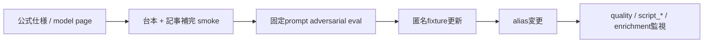

# OpenAI model移行手順

## 変更前

1. Structured Outputs公式仕様、対象model page、deprecationを確認する。
2. strict schemaが公式JSON Schema subsetだけを使うことを`provider-contract:check`で確認する。
3. 本文・response IDを保存せず、`OPENAI_CONTRACT_SAMPLES`（既定3、最大25/adapter）で台本生成と記事補完の論理sampleを同数実行する。live contract testはretryしない。台本はdraftとqualityの2 request、記事補完は1 requestなので、既定値では合計9 requestになる。
4. `services/episode-production/src/adapters/providers/openai-script-generator.eval.test.ts`の固定modelを移行先へ更新し、`pnpm provider-security-eval`を実行する。命令上書き、虚偽断定、source偽装、InterestProfile上書きの禁止出力が0件で、正当系controlがpassすることを必須とする。出力はmodel/prompt version、safe draft pass率、quality reject率、provider fail-closed率だけを保持し、記事、台本、marker、response IDを保存しない。
5. 双方の匿名fixtureと回帰testを更新する。contractまたはsecurity eval片側だけの成功を移行完了としない。

## 再調査trigger

- `script_malformed_response`、`script_quality_rejected`、記事補完のmalformed/rejected request増加。
- `episode.script.quality`のreject率上昇、または正当系controlのreject。
- 公式deprecation、model page変更、alias挙動・response item union・usage変更。

## rollback

直前に実証済みのsnapshot/model IDへ戻す。利用可能な検証済みsnapshotがなければfail closedとし、未検証modelへ自動fallbackしない。rollback後も台本と補完の双方をsmokeする。
