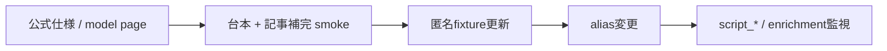

# OpenAI model移行手順

## 変更前

1. Structured Outputs公式仕様、対象model page、deprecationを確認する。
2. strict schemaが公式JSON Schema subsetだけを使うことを`provider-contract:check`で確認する。
3. 本文・response IDを保存せず、`OPENAI_CONTRACT_SAMPLES`（既定3、最大25/adapter）で台本生成と記事補完を同数実行する。live contract testはretryしないため、実リクエスト数は設定値どおりになる。
4. 双方の匿名fixtureと回帰testを更新する。片側だけの成功を移行完了としない。

## 再調査trigger

- `script_malformed_response`、記事補完のmalformed/rejected request増加。
- 公式deprecation、model page変更、alias挙動・response item union・usage変更。

## rollback

直前に実証済みのsnapshot/model IDへ戻す。利用可能な検証済みsnapshotがなければfail closedとし、未検証modelへ自動fallbackしない。rollback後も台本と補完の双方をsmokeする。
