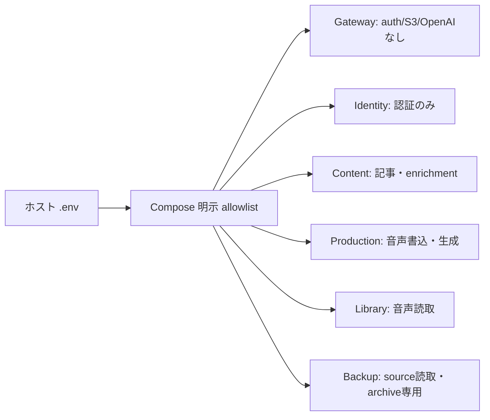

# サービスごとの秘密情報と S3 権限

`.env` はホスト上の Compose 補間入力であり、コンテナへの全量配布は禁止する。実際の注入は `compose.yaml` の各 `environment` に限定する。変数名の完全な許可リストは [service-environment.json](../../infra/security/service-environment.json)、初期値は [.env.example](../../.env.example) を正本とする。追加時は両方と検証を更新する。

| 所有者 | 秘密情報（ホスト上の変数名） | その他の許可対象 |
| --- | --- | --- |
| Gateway | `TELEMETRY_PROXY_TOKEN` | Gateway・認証proxy・browser telemetry設定、Identity origin、NATS、公開Google client ID、dev authの有効フラグ |
| Identity | `BETTER_AUTH_SECRET`、`GOOGLE_CLIENT_SECRET`、`DEV_AUTH_PASSWORD` | Identity DB・HTTP・queue、公開URL/client ID/dev user ID、NATS |
| Content | `CONTENT_OPENAI_API_KEY`、`CONTENT_S3_*` | Content DB・RSS・archive・enrichment・search、OpenAI model/URL、NATS |
| Production | `PRODUCTION_OPENAI_API_KEY`、`PRODUCTION_S3_*` | Production DB・worker・scheduler・completion、OpenAI/TTS/retry設定、NATS |
| Library | `LIBRARY_S3_*` | Library DB・completion consumer・NATS、S3 endpoint/bucket/region |
| Backup | `BACKUP_SOURCE_S3_*`、`BACKUP_ARCHIVE_*`、暗号鍵ファイル | source/archive設定、barrier・保持期間・drill、承認attestationファイル |
| Watchdog | `WATCHDOG_SMTP_PASSWORD` | SMTP・watchdog設定とobservability health URL |
| SeaweedFS | `s3-identities` secretファイルのみ | `S3_BUCKET`。管理者credentialをアプリへ配布しない |
| Web | なし | `GATEWAY_ORIGIN`、`NGINX_ENVSUBST_FILTER` |

5つのNode contextには `APP_ENV` と `OTEL_*` の明示された設定だけを共有する。`OTEL_EXPORTER_OTLP_HEADERS` はcollector認証が必要な場合の共通秘密情報であり、collector所有者が管理する。専用collector credentialが必要な運用では各サービスの補間元を分ける。S3とOpenAIのcontext別ホスト変数は、コンテナ内では既存parserの `S3_ACCESS_KEY_ID` / `S3_SECRET_ACCESS_KEY` / `OPENAI_API_KEY` へ写す。他contextの名前・値は渡さない。



## S3 の最小権限

[infra/security](../../infra/security/) の `s3-policy-*.json` を各principalへ個別に適用する。ソースbucket名は実環境へ置換し、archiveの `REPLACE_WITH_ARCHIVE_BUCKET` は独立したObject Lock有効bucketへ置換する。AWS IAMにも同じpolicyを適用できる。暗号鍵KMS利用時は対象鍵に限定した権限を別途設計する。

| Principal | Object prefix | 操作 | Bucket操作 |
| --- | --- | --- | --- |
| Content | `articles/*` | Get/Put/Delete | `articles/*` prefix指定時だけList |
| Production | `episodes/*` | Put/Delete（失敗cleanup用） | なし |
| Library | `episodes/*` | Get（署名URL発行用） | なし |
| Backup source | `articles/*`、`episodes/*` | Get | 全体List（整合性inventoryのため）。他prefixのGetは不可 |
| Backup archive | `generations/*` | Get/Put/PutObjectRetention | generationsだけList、versioning/Object Lockの状態読取 |

Backup archiveのGetは復元drillに必要。Delete、保持短縮のためのBypassGovernanceRetention、bucket管理、source書込は許可しない。sourceとarchiveは同一credentialを使わない。アプリにはbucket作成権限を与えず、管理者が事前作成する。既存object prefixを変えないためデータ移動は不要。

SeaweedFSは `-s3.config` で同じIAM policyを読み、legacyな全bucket Read/Write/Admin actionは与えない。既定の `s3-identities.development.json` は公開された開発専用credentialであり、本番には使わない。固定版SeaweedFSはListBucketをbucket/prefix ARNでも評価するため、生成設定だけそのresourceを追加する（prefix条件は維持）。構文は [SeaweedFSの固定revisionのIAM定義](https://github.com/seaweedfs/seaweedfs/blob/3ff92f797da66fc829dae254aced133de12a107a/weed/pb/iam.proto) に従う。

## ローカル開発と検証

```bash
pnpm setup:env
# .env のサービス別credentialを編集後、SeaweedFS側の設定を再生成
pnpm setup:s3
pnpm dev:up
pnpm security:env:check
pnpm security:env:runtime
# 稼働中のbackup profileも含める場合
pnpm security:env:runtime --profile backup
```

`setup:env` は既存 `.env` を上書きせず、S3設定を `.secrets/s3-identities.json` へ0600で生成する。`S3_IDENTITIES_FILE_HOST` をこのファイルに設定する。生成はローテーションではない。サービス別鍵を変えてから再生成・再起動する。非標準bucketもgeneratorがpolicyへ反映する。Composeのbind secretはホストの0600権限を保つため、SeaweedFSは起動時だけrootで読み、専用tmpfsへ0400でコピーしてからupstream entrypointでseaweedユーザーへ降格する。

検証はコンテナ内で `Object.keys(process.env)` のみを取得し、許可外の既知変数やsecret名を検出したら非ゼロ終了する。空文字でも存在すれば失敗。ログはサービス名・PASS/FAIL・違反した変数名のみで、値やDocker失敗時のdiagnosticは出さない。Web/SeaweedFS/初期化jobはNodeを持たないためCompose設定で検査し、Nodeアプリは実コンテナも検査する。停止中コンテナは検証失敗になる。CIではCompose展開とsecret所有者をテストする。

## 既存環境の移行・ローテーション

1. 所有者が現在のcredential利用先を棚卸しし、バックアップの成功と復元手順を確認する。旧鍵の値はチケット・PR・ログに貼らない。
2. 各S3 principalを上表のpolicyで作成する。Content/Production用OpenAI keyも別々に発行する。sourceとarchiveは別endpoint/bucket・別credentialを維持する。新鍵は旧鍵と並行して有効にする。
3. `.env.example` の新しい `CONTENT_`、`PRODUCTION_`、`LIBRARY_`、`BACKUP_SOURCE_` 変数を既存 `.env` に追加する。旧共有 `OPENAI_API_KEY` / `S3_ACCESS_KEY_ID` / `S3_SECRET_ACCESS_KEY` へのfallbackはない。`S3_IDENTITIES_FILE_HOST=./.secrets/s3-identities.json` を設定し、`pnpm setup:s3` で生成する。
4. `pnpm security:env:check` 後、SeaweedFSと対象アプリを再作成する。S3 static設定更新は `docker compose up -d --force-recreate seaweedfs content-knowledge episode-production episode-library`。認証鍵を変える場合はIdentityも再作成する。health、記事archive/replay、生成・再生・cleanupを確認する。
5. Backupのsource/archive credential fingerprintが変わるため、[backup runbook](service-state-recovery.md) に従いtarget attestationを再発行する。古いattestationを使い回さず、backup/drill成功を確認する。
6. `pnpm security:env:runtime` とbackup profile検証で、他contextのsecret名が存在しないことを確認する。S3テストではLibraryのPut、Productionの記事アクセス、Contentの音声アクセス、Backup sourceのPutが拒否されることを確認する。
7. 新鍵での稼働確認後に旧共有S3/OpenAI鍵を失効する。過去に全コンテナへ配布していたBetter Auth、OAuth secret、SMTP/collector/backup credentialも所有者ごとにローテーションする。Better Auth secret変更は既存sessionへの影響を調整する。変更時刻・所有者・検証結果だけを記録する。
8. `.env` の旧共有鍵を削除し、保持ポリシーに沿って旧secretファイルを破棄する。失効前の障害では直前のサービス専用鍵へ戻して再作成する。旧共有鍵を再配布してrollbackしない。

本変更は実運用の鍵を自動失効・変更しない。移行責任者は上記の稼働検証と旧鍵失効までを完了記録する。
