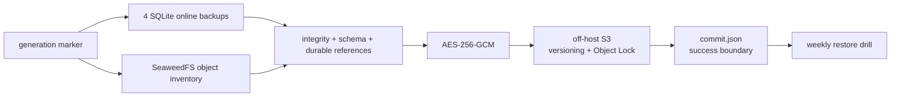
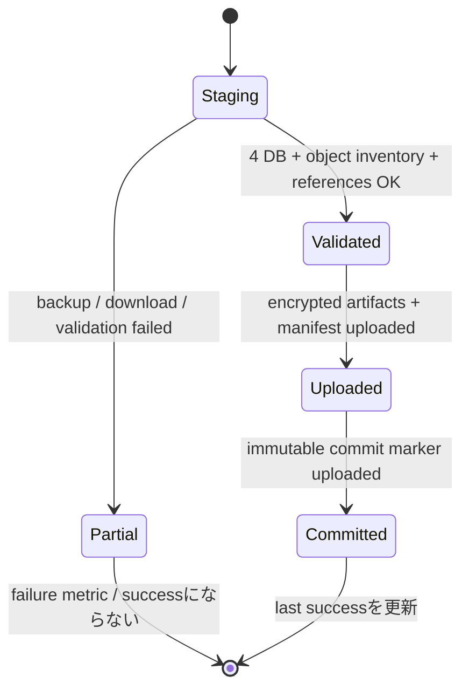
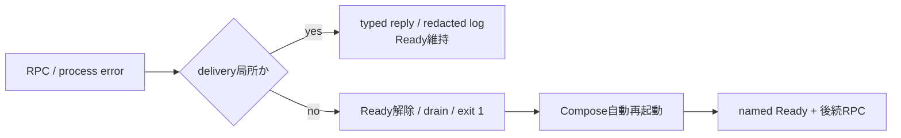

# Coordinated service state backup / restore

正本は、4つのservice専用SQLiteとSeaweedFS上のarticle archive・Episode audioを同じ世代へ束ねる`state-backup`である。個別SQLite CLIはcutoverと限定的な手動退避にだけ使い、DBだけの退避を災害復旧可能な世代と扱わない。



## 対象

| Compose service | profile | live DB | 必須anchor table |
| --- | --- | --- | --- |
| `identity-access` | `identity` | `/app/data/identity.sqlite` | `user_settings` |
| `content-knowledge` | `content` | `/app/data/content.sqlite` | `feed_subscriptions` |
| `episode-production` | `production` | `/app/data/production.sqlite` | `episode_jobs` |
| `episode-library` | `library` | `/app/data/library.sqlite` | `episodes` |

SeaweedFSの対象bucketは、同じinventoryに含まれる全objectである。`article_snapshots.snapshot_json`内のraw/replay/Markdown/assetsと、`episodes.audio_object_key`の全参照がinventoryのhash・sizeと一致しなければ世代をcommitしない。

## 保護方針

| 項目 | 決定 | 運用境界 |
| --- | --- | --- |
| RPO | 24時間 | schedulerは24時間ごと。25時間でcritical alert |
| RTO | 4時間 | 最新commit世代の復号・検証、object復元、4 DB cutover、read smokeまで |
| 世代保持 | 直近30成功世代 | bucket lifecycleはObject Lock満了前に削除してはならない |
| 改変不能期間 | 最低35日 | 各PutをS3 Object Lock `COMPLIANCE`で固定 |
| 暗号化 | client-side AES-256-GCM | 32 byte鍵はCompose secret。外部bucket管理者から分離保管 |
| 外部保管 | sourceと異なるoff-host S3 bucket | versioningとObject Lockが起動時の必須検査 |
| drill | 7日ごと | 8日未成功でcritical alert |

bucket lifecycleは「35日間は保持し、30成功世代を下回らない」規則に設定する。鍵を失うと全世代を復号できない。鍵はrepository・同一host・同一S3 accountに保管せず、rotationは旧鍵で保護した全世代が保持対象外になった後に行う。

## 初期設定と自動Backup

外部bucketは作成時にObject Lockを有効にし、versioningを停止しない。sourceと同じSeaweedFS bucketは設定検査で拒否される。32 byte鍵をhexまたはbase64でsecret fileへ保存し、権限をowner read-onlyにする。

```bash
mkdir -p .secrets
openssl rand -hex 32 > .secrets/backup-encryption-key
chmod 600 .secrets/backup-encryption-key

docker compose --profile backup up -d --build state-backup
docker compose --profile backup ps state-backup
curl --fail --silent http://127.0.0.1:4198/metrics
```

endpoint、bucket、専用credentialsは`.env`の`BACKUP_ARCHIVE_*`へ設定する。`BACKUP_ENCRYPTION_KEY_FILE_HOST`はhost上のsecret fileを指す。起動直後に1世代を作り、全成果物のimmutable Putが成功した最後にだけ`generations/<generation>/commit.json`を置く。



manifestはgeneration、4 DBのprofile/schema/hash、SeaweedFS inventory fingerprint、全objectのkey/hash/size、参照件数、保護policyを持ち、manifest自体も暗号化する。途中uploadだけが残ったprefixにはcommit markerがないため、restore候補にも成功metricにも現れない。

## 自動Restore drillと監視

daemonは週次に最新commit世代を隔離stagingへ取得し、次をすべて検証してから一時復元物を消す。live volumeは変更しない。

1. commitと暗号化manifestのSHA-256、AES-GCM認証tag
2. 4 DBの平文SHA-256、`integrity_check`、service anchor table
3. 全objectの平文SHA-256とsize
4. 全article archive objectと全Episode audioのDB参照整合性

| metric / alert | 意味 | 初動 |
| --- | --- | --- |
| `news_podcast_backup_last_success_timestamp_seconds` | 最後のcommit時刻 | generation prefixと構造化failure logを確認 |
| `news_podcast_backup_generation_age_seconds` / `np-backup-rpo` | 最新世代age / 25時間超過 | source DB・SeaweedFS・外部S3を切り分ける |
| `news_podcast_backup_failures_total` / `np-backup-failure` | backup失敗 | commitなしprefixを成功扱いしない |
| `news_podcast_restore_drill_last_success_timestamp_seconds` / `np-backup-drill-stale` | drill成功時刻 / 8日超過 | 最新commitの復号、hash、参照失敗を確認 |
| `news_podcast_restore_drill_failures_total` | drill失敗 | 鍵、retention、破損object、DB schemaを確認 |

## 個別SQLite backup（限定用途）

例はProduction。migration直前の短期退避などに限定し、これ単独をcoordinated generationと呼ばない。日時を固定した一意なfile名に置き換える。

```bash
docker compose exec episode-production \
  node /app/scripts/sqlite-state.mjs backup production \
  /app/data/production.sqlite \
  /app/data/backups/production-20260813T030000Z.sqlite

mkdir -p backups
docker compose cp \
  episode-production:/app/data/backups/production-20260813T030000Z.sqlite \
  backups/production-20260813T030000Z.sqlite
sha256sum backups/production-20260813T030000Z.sqlite
```

- 同名destinationが存在すると失敗する。世代を暗黙に上書きしない。
- backup後に`integrity_check`とprofile検査を自動実行する。
- 災害復旧用には`state-backup`のcommit世代を使い、個別SQLiteとS3 objectを別々の世代として組み合わせない。

## 障害時cutover

まず外部保管したfileを対象volumeへ置き、live DBとは別名で復元する。

```bash
docker compose stop episode-production
docker compose run --rm --no-deps episode-production \
  mkdir -p /app/data/incoming
docker compose cp \
  backups/production-20260813T030000Z.sqlite \
  episode-production:/app/data/incoming/production.sqlite

docker compose run --rm --no-deps episode-production \
  node /app/scripts/sqlite-state.mjs restore production \
  /app/data/incoming/production.sqlite \
  /app/data/production.restored.sqlite
```

復元先が既にあれば中断し、対象pathを目視確認する。検証後、旧DBを削除せずquarantine名へ移してcutoverする。

```bash
docker compose run --rm --no-deps episode-production sh -ec '
  test -f /app/data/production.sqlite
  test -f /app/data/production.restored.sqlite
  mv /app/data/production.sqlite /app/data/production.pre-restore.sqlite
  mv /app/data/production.restored.sqlite /app/data/production.sqlite
'
docker compose up -d --no-deps --wait episode-production
curl --fail --silent http://127.0.0.1:4104/health/ready
```

readiness後にowner-scoped job GET/listと、外部副作用を起こさないread smokeを行う。失敗時はserviceを停止し、`production.pre-restore.sqlite`を元のpathへ戻す。成功確認と保管期間終了まではquarantine DBを削除しない。

## 復旧記録

| 記録 | 必須値 |
| --- | --- |
| backup | commit generation、UTC日時、manifest cipher SHA-256、source object generation |
| restore | 4 DB SHA-256、全object hash/size、`integrity_check`結果 |
| smoke | readiness、owner-scoped read、article archive、Episode audio参照照合 |
| rollback | 実施有無、quarantine path、原因trace ID |

## Runtime障害の切り分け



| 状態 | 確認 | 対応 |
| --- | --- | --- |
| 単発RPC失敗 | service/component/scope/error type、後続RPC、Ready 200 | payloadを採取せずcorrelation IDで追跡する |
| Ready 503 | health JSONの失敗したnamed check | NATS、DB、completion relay等の必須resourceを確認する |
| process再起動 | `docker compose ps`、structured Cause、restart count | 原因依存を復旧し、Ready復帰と後続RPCを確認する |
| restart loop | initialization failureとDB `integrity_check` | 自動再起動を止める前にlog/DB backupを保全する |

SIGINT/SIGTERMはresource drainとtelemetry flush後にexit 0、subscription/connection終了、初期化失敗、process fatalはexit 1である。NATS drainが1秒以内に終わらない場合はconnectionをcloseし、終了処理自体の停止を防ぐ。Docker healthは観測専用であり、回復不能状態はapplication自身が終了する。詳細は[ADR-0052](../adr/0052-rpc-failure-isolation-and-self-healing-runtime.md)を参照する。

SQLite接続は各serviceのprocess rootが1本だけopenし、停止時に子runtimeを終了してからcloseする。Episode ProductionではRPC、worker、completion relay、schedulerが同じconnectionを共有するため、同一pathへのnested connectionを前提にロック障害を調査しない。`SQLITE_BUSY`が継続する場合は別processのCLI、backup、旧containerが同じvolumeへ接続していないかを確認する。

`CorruptRecord` は一時的なDB障害としてretryしない。failure/logに保存値自体は出ないため、`operation`（例: `episode_generation_plans.selected_article_ids`）から対象列を特定する。稼働中DBを直接編集せず、backupを複製してSchema検証し、正常なbackupから復元するか、検証済みmigrationとして修復する。Productionの旧`selected_articles=[]`だけは互換経路で自動復元される。

## Article archive orphan cleanup

Content Knowledgeは部分Put失敗時に成功済みobjectを即時削除し、さらに既定6時間ごとにS3とSQLiteを照合する。`CONTENT_ARCHIVE_ORPHAN_RETENTION_MS`（既定24時間）より古く、`article_snapshots`に参照がないUUID snapshot prefixだけが対象になる。

| 観測 | 対応 |
| --- | --- |
| `object.cleanup{cleanup.result="failed"}`が1以上 | Content logの`object.cleanup.failed`をtraceで追い、S3権限・容量・接続を確認する |
| 3周期連続でDelete失敗 | 自動削除を手動で代行せず、S3障害を復旧した後の次周期を確認する |
| 対象が0件 | 正常。object keyはlog/metricへ出ない |

間隔は`CONTENT_ARCHIVE_CLEANUP_INTERVAL_MS`で調整できる。保持期間をcapture timeoutより短くしない。詳細は[ADR-0066](../adr/0066-reconcile-orphan-article-archive-objects.md)を参照する。

## Content Outbox廃止migration記録

2026-08-15に未使用のContent archive event/outboxを廃止した。migration前のonline backupと検証値は次の通り。

| 項目 | 値 |
| --- | --- |
| backup | `<secure-backup-path>/content-<timestamp>.sqlite` |
| quick check | `ok` |
| 未配信Outbox | `<verified-count>`件 |
| SHA-256 | `<verified-sha256>` |

`20260815135150_jittery_makkari`は`content_outbox`とそのindexだけを削除する。記事snapshot、購読、タグ候補の保持はmigration testで固定し、Content参照はNATS RPCを正本とする。
