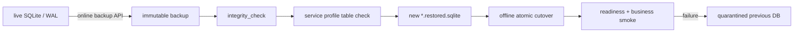
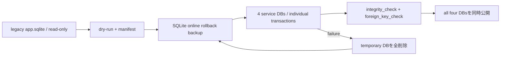

# Service state backup / restore

対象はfunctional backendの4つのservice専用SQLiteである。online backupは稼働中に取得できる。restoreとcutoverは対象serviceを停止し、別pathへ検証復元してから行う。既存DBへの上書きと別serviceのDB復元はCLIが拒否する。



## 対象

| Compose service | profile | live DB | 必須anchor table |
| --- | --- | --- | --- |
| `identity-access` | `identity` | `/app/data/identity.sqlite` | `user_settings` |
| `content-knowledge` | `content` | `/app/data/content.sqlite` | `feed_subscriptions` |
| `episode-production` | `production` | `/app/data/production.sqlite` | `episode_jobs` |
| `episode-library` | `library` | `/app/data/library.sqlite` | `episodes` |

## 旧共有DBからの初回分割

旧`app.sqlite`を直接変更せず、まずdry-runでschema・外部キー・件数manifestを検査する。移行先4 DBのいずれかが存在する場合は中断するため、必ず空のdirectoryを指定する。



```bash
pnpm state:migrate:functional-ddd -- \
  --source data/app.sqlite \
  --destination-dir data/functional \
  --dry-run \
  --manifest data/migration-dry-run.json

pnpm state:migrate:functional-ddd -- \
  --source data/app.sqlite \
  --destination-dir data/functional \
  --backup backups/app-pre-functional-ddd.sqlite \
  --manifest backups/functional-ddd-migration.json
```

| 変換対象 | 方針 |
| --- | --- |
| auth・schedule | Identityへowner IDを保持して移行 |
| feeds・subscriptions・articles・snapshots・state・tags・enrichment | Contentへ移行。旧snapshotで不足するartifact別hashは旧content hashを互換metadataとして保持し、manifestへ記録 |
| jobs | Productionへ移行。未完了jobは二重副作用防止のため`legacy-migration-requires-retry`で停止 |
| dictionary・agent audit・memory | Productionへ移行。未完了agent runは停止し、旧event/tool/approval payloadは機密情報・reasoningを移さず監査metadataだけ保持 |
| episodes・sources | Libraryへ移行。audioまたはRSS snapshot参照が欠けるrecordは全移行を中断 |
| legacy execution draft/audio chunk | 再開せずmanifestに破棄予定件数を記録。rollback backupには完全保持 |

CLIは次をfail closedで扱う。

- 現行旧schemaの必須tableがない、`integrity_check`/`foreign_key_check`が失敗する。
- snapshotのSHA-256・object key・時刻、episodeのaudio、RSS sourceのsnapshotが不正または欠落する。
- agent runとjobのownerが一致しない。
- rollback backupまたは移行先DBが既に存在する。

成功後はmanifestのsource/target件数を運用記録へ添付し、4 serviceを停止した状態でComposeの各DB pathへ配置する。readinessとowner-scoped smokeが完了するまで、旧共有DBと`--backup`で作成したrollback backupを削除しない。

## Backup

例はProduction。日時を固定した一意なfile名に置き換える。

```bash
docker compose exec episode-production \
  node /app/scripts/sqlite-state.mjs backup production \
  /app/data/production.sqlite \
  /app/data/backups/production-20260813T030000Z.sqlite

mkdir -p backups
docker compose cp \
  episode-production:/app/data/backups/production-20260813T030000Z.sqlite \
  backups/production-20260813T030000Z.sqlite
sha256sum backups/production-20260813T030000Z.sqlite
```

- 同名destinationが存在すると失敗する。世代を暗黙に上書きしない。
- backup後に`integrity_check`とprofile検査を自動実行する。
- SQLite backupとS3 objectは別々の世代にしない。episode audio/article archiveを含むS3 snapshot IDとSQLite backup hashを同じ運用記録へ残す。

## Restore drill / cutover

まず外部保管したfileを対象volumeへ置き、live DBとは別名で復元する。

```bash
docker compose stop episode-production
docker compose run --rm --no-deps episode-production \
  mkdir -p /app/data/incoming
docker compose cp \
  backups/production-20260813T030000Z.sqlite \
  episode-production:/app/data/incoming/production.sqlite

docker compose run --rm --no-deps episode-production \
  node /app/scripts/sqlite-state.mjs restore production \
  /app/data/incoming/production.sqlite \
  /app/data/production.restored.sqlite
```

復元先が既にあれば中断し、対象pathを目視確認する。検証後、旧DBを削除せずquarantine名へ移してcutoverする。

```bash
docker compose run --rm --no-deps episode-production sh -ec '
  test -f /app/data/production.sqlite
  test -f /app/data/production.restored.sqlite
  mv /app/data/production.sqlite /app/data/production.pre-restore.sqlite
  mv /app/data/production.restored.sqlite /app/data/production.sqlite
'
docker compose up -d --no-deps --wait episode-production
curl --fail --silent http://127.0.0.1:4104/health/ready
```

readiness後にowner-scoped job GET/listと、外部副作用を起こさないread smokeを行う。失敗時はserviceを停止し、`production.pre-restore.sqlite`を元のpathへ戻す。成功確認と保管期間終了まではquarantine DBを削除しない。

## 受け入れ記録

| 記録 | 必須値 |
| --- | --- |
| backup | service/profile、UTC日時、SHA-256、S3 snapshot ID |
| restore | source SHA-256、復元先、`integrity_check`結果 |
| smoke | readiness、owner-scoped read、件数/hash照合 |
| rollback | 実施有無、quarantine path、原因trace ID |
