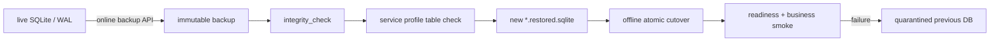
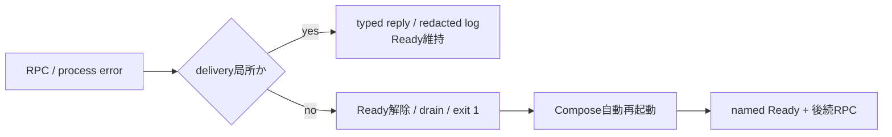

# Service state backup / restore

対象はfunctional backendの4つのservice専用SQLiteである。online backupは稼働中に取得できる。restoreとcutoverは対象serviceを停止し、別pathへ検証復元してから行う。既存DBへの上書きと別serviceのDB復元はCLIが拒否する。



## 対象

| Compose service | profile | live DB | 必須anchor table |
| --- | --- | --- | --- |
| `identity-access` | `identity` | `/app/data/identity.sqlite` | `user_settings` |
| `content-knowledge` | `content` | `/app/data/content.sqlite` | `feed_subscriptions` |
| `episode-production` | `production` | `/app/data/production.sqlite` | `episode_jobs` |
| `episode-library` | `library` | `/app/data/library.sqlite` | `episodes` |

## Backup

例はProduction。日時を固定した一意なfile名に置き換える。

```bash
docker compose exec episode-production \
  node /app/scripts/sqlite-state.mjs backup production \
  /app/data/production.sqlite \
  /app/data/backups/production-20260813T030000Z.sqlite

mkdir -p backups
docker compose cp \
  episode-production:/app/data/backups/production-20260813T030000Z.sqlite \
  backups/production-20260813T030000Z.sqlite
sha256sum backups/production-20260813T030000Z.sqlite
```

- 同名destinationが存在すると失敗する。世代を暗黙に上書きしない。
- backup後に`integrity_check`とprofile検査を自動実行する。
- SQLite backupとS3 objectは別々の世代にしない。episode audio/article archiveを含むS3 snapshot IDとSQLite backup hashを同じ運用記録へ残す。

## Restore drill / cutover

まず外部保管したfileを対象volumeへ置き、live DBとは別名で復元する。

```bash
docker compose stop episode-production
docker compose run --rm --no-deps episode-production \
  mkdir -p /app/data/incoming
docker compose cp \
  backups/production-20260813T030000Z.sqlite \
  episode-production:/app/data/incoming/production.sqlite

docker compose run --rm --no-deps episode-production \
  node /app/scripts/sqlite-state.mjs restore production \
  /app/data/incoming/production.sqlite \
  /app/data/production.restored.sqlite
```

復元先が既にあれば中断し、対象pathを目視確認する。検証後、旧DBを削除せずquarantine名へ移してcutoverする。

```bash
docker compose run --rm --no-deps episode-production sh -ec '
  test -f /app/data/production.sqlite
  test -f /app/data/production.restored.sqlite
  mv /app/data/production.sqlite /app/data/production.pre-restore.sqlite
  mv /app/data/production.restored.sqlite /app/data/production.sqlite
'
docker compose up -d --no-deps --wait episode-production
curl --fail --silent http://127.0.0.1:4104/health/ready
```

readiness後にowner-scoped job GET/listと、外部副作用を起こさないread smokeを行う。失敗時はserviceを停止し、`production.pre-restore.sqlite`を元のpathへ戻す。成功確認と保管期間終了まではquarantine DBを削除しない。

## 受け入れ記録

| 記録 | 必須値 |
| --- | --- |
| backup | service/profile、UTC日時、SHA-256、S3 snapshot ID |
| restore | source SHA-256、復元先、`integrity_check`結果 |
| smoke | readiness、owner-scoped read、件数/hash照合 |
| rollback | 実施有無、quarantine path、原因trace ID |

## Runtime障害の切り分け



| 状態 | 確認 | 対応 |
| --- | --- | --- |
| 単発RPC失敗 | service/component/scope/error type、後続RPC、Ready 200 | payloadを採取せずcorrelation IDで追跡する |
| Ready 503 | health JSONの失敗したnamed check | NATS、DB、completion relay等の必須resourceを確認する |
| process再起動 | `docker compose ps`、structured Cause、restart count | 原因依存を復旧し、Ready復帰と後続RPCを確認する |
| restart loop | initialization failureとDB `integrity_check` | 自動再起動を止める前にlog/DB backupを保全する |

SIGINT/SIGTERMはresource drainとtelemetry flush後にexit 0、subscription/connection終了、初期化失敗、process fatalはexit 1である。NATS drainが1秒以内に終わらない場合はconnectionをcloseし、終了処理自体の停止を防ぐ。Docker healthは観測専用であり、回復不能状態はapplication自身が終了する。詳細は[ADR-0052](../adr/0052-rpc-failure-isolation-and-self-healing-runtime.md)を参照する。

## Content Outbox廃止migration記録

2026-08-15に未使用のContent archive event/outboxを廃止した。migration前のonline backupと検証値は次の通り。

| 項目 | 値 |
| --- | --- |
| backup | `/home/<operator>/backups/news-podcast/content-<timestamp>.sqlite` |
| quick check | `ok` |
| 未配信Outbox | <verified-count>件 |
| SHA-256 | `<verified-sha256>` |

`20260815135150_jittery_makkari`は`content_outbox`とそのindexだけを削除する。記事snapshot、購読、タグ候補の保持はmigration testで固定し、Content参照はNATS RPCを正本とする。
