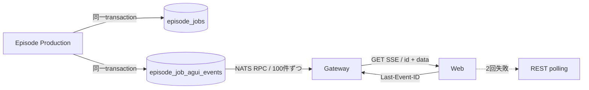
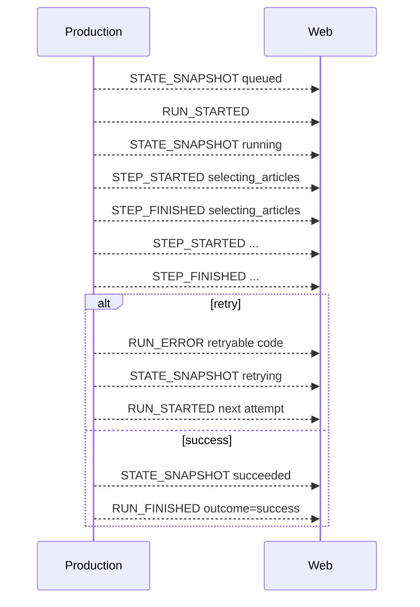

# Episode Job進捗プロトコル

- Status: Active
- Version: 1（2026-08-16）
- Event schema: `@ag-ui/core@0.0.58` の `EventSchemas`
- Endpoint: `GET /v1/episode-jobs/{jobId}/events`

## 1. 契約の範囲

Podcast生成は非同期jobであるため、AG-UIのイベント形状を使いながらtransportだけを拡張する。イベント名やpayloadを独自解釈せず、受信側は公式`EventSchemas`と本APIのEffect Schemaの両方で検証する。



## 2. AG-UI準拠部分

使用するイベントは次の公式6種だけである。`CUSTOM`、`STATE_DELTA`、tool call、reasoning eventは送らない。

| Event | 用途 | 必須フィールド |
| --- | --- | --- |
| `STATE_SNAPSHOT` | jobの完全な公開状態 | `snapshot` |
| `RUN_STARTED` | attempt開始 | `threadId`, `runId` |
| `STEP_STARTED` | stage開始 | `stepName` |
| `STEP_FINISHED` | stage完了 | `stepName` |
| `RUN_ERROR` | retry・失敗・取消 | `message`, `code` |
| `RUN_FINISHED` | 成功終了 | `threadId`, `runId`, `outcome` |

- `threadId = jobId`
- `runId = <jobId>:attempt:<n>`
- `timestamp`はUnix epoch milliseconds
- retryは同じrunの継続ではなく、次attemptの新しいrun
- providerのchain-of-thoughtや架空のtool実行は公開しない

### 標準イベント列



step名は順に`selecting_articles`、`materializing_articles`、`generating_script`、`preparing_pronunciation`、`synthesizing_audio`、`storing_episode`で固定する。checkpointから再開したstepは再実行しないため、そのattemptではeventが省略される場合がある。

## 3. EpisodeJobState

`STATE_SNAPSHOT.snapshot`は差分ではなく常に完全置換する。

```ts
type EpisodeJobState = {
  jobId: string
  status: "queued" | "running" | "retrying" | "succeeded" | "failed" | "canceled"
  attempt: number
  maxAttempts: 4
  selectionMode: "automatic" | "manual"
  selectedArticles: Array<{
    articleId: string
    title?: string       // materialize後に存在
    sourceName?: string  // materialize後に存在
  }>
  currentStage?: EpisodeJobStep
  failure?: { code: string; message: string; retryable: boolean }
  episodeId?: string
}
```

記事本文、prompt、台本、完全URL、API keyはstateとeventへ含めない。

## 4. Transport拡張

AG-UIのPOST型`HttpAgent`は採用しない。job作成とstreamを分離し、既存のowner認可と再開可能GETを維持する。

```http
GET /v1/episode-jobs/{jobId}/events HTTP/1.1
Accept: text/event-stream
Last-Event-ID: 42
```

```text
id: 43
data: {"type":"STEP_STARTED","timestamp":1786849200000,"stepName":"generating_script"}

```

これはAG-UI event envelopeを変更しないtransport extensionである。

- `id`はowner/job内の単調増加SQLite `sequence`
- wire frameは`id:`と`data:`だけ。`event:`は送らない
- 1回に最大100件を昇順replayし、残りをdrainしてからtailする
- 切断後は`Last-Event-ID`より大きいsequenceだけを再送する
- terminal jobかつ未送信eventが無くなれば接続を閉じる
- 移行前jobにeventが無い場合だけ、現在のREST状態から`STATE_SNAPSHOT`を合成する
- owner不一致と存在しないjobは同じ404へ正規化する

## 5. 冪等性と障害時動作

`event_key`はjob・attempt・run/step・phaseから作り、lease回収や重複実行でも同じ論理eventを1回だけ保存する。job状態遷移と対応event追記は同じSQLite transactionでcommitする。Webは公式schema不適合eventを捨て、最後に適用したsequence以下を重複・逆順として無視する。`RUN_ERROR`時は未完了stepを閉じ、次の`STATE_SNAPSHOT retrying`と`RUN_STARTED`まで既存timelineを保持する。

## 6. 将来の拡張

標準eventで表現できない情報が必要になった場合だけ、`CUSTOM`名を`news-podcast.<name>.v1`として追加する。追加時は公式`EventSchemas`、Effect Schema、OpenAPI、Web reducer、本仕様、contract testを同時更新する。token単位・VOICEVOX chunk単位のprogressは現versionの対象外である。
