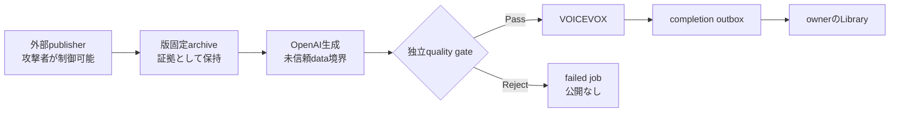

# セキュリティ脅威モデル

## 未信頼RSSからPodcast公開まで

| 項目 | 契約 |
| --- | --- |
| 攻撃者能力 | RSSのtitle/markdownへ命令、role偽装、区切り、コード、符号化文字列、虚偽文、source偽装を埋め込める |
| 保護対象 | 台本と音声の根拠整合性、InterestProfile、source provenance、owner向けLibraryの信頼性 |
| 信頼しない値 | RSS title/markdown、生成draft、provider応答内の自由文 |
| 信頼する境界 | owner scope、版固定snapshot ID、opaque source ID mapping、strict schema、application側quality判定とlease fence |

### セキュリティ不変条件

1. 記事中の命令はデータであり、system契約・InterestProfile・source境界を上書きしない。
2. schemaとsource IDが正しくても、注入追従・根拠外断定・source偽装・InterestProfile上書きが疑われるdraftは受理しない。
3. `pass + none`のquality結果だけをcheckpointできる。reject後はVOICEVOX、ObjectStore、completion outbox、Libraryへ到達しない。
4. log/metric/eval reportへ記事本文、台本、完全URL、provider ID、credential、攻撃markerを出さない。
5. modelまたはprompt version変更は4攻撃クラスと正当系controlのlive evalを通す。

### 残余リスク

- 生成器と評価器は同一modelであり、未知の言い換えや相関した誤判定を完全には除去できない。
- 外部事実の真偽を別情報源で照合せず、選択済みsnapshotとの整合だけを評価する。
- live evalは代表ケースであり、全prompt injection表現の証明ではない。

残余リスクが顕在化した場合は公開を手動で迂回せず、該当model/prompt versionを停止して[OpenAI model移行手順](operations/openai-model-migration.md)と[ADR-0080](adr/0080-gate-untrusted-article-scripts-before-publication.md)の再検討条件に従う。
