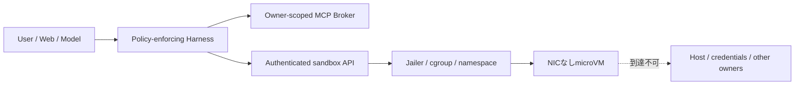

# Agent sandbox threat model

- Status: Accepted baseline
- Updated: 2026-08-10
- Decision: [ADR-0015](../adr/0015-firecracker-agent-harness.md)

## 保護対象と信頼境界

| 保護対象 | 防ぐこと |
| --- | --- |
| host、`/dev/kvm`、Firecracker control socket | Agent・Web内容からの直接到達 |
| OpenAI、DB、S3、認証credential | prompt、workspace、commandへの露出 |
| owner別RSS、Episode、Memory | ownerまたはAgent instance間の漏えい |
| Job、tool、TTS、artifact | retry/resumeによる二重副作用 |
| 長期Memory | prompt injection・秘密の永続化 |

信頼するのは運用者、署名・digest固定したrunner/kernel/rootfs、Applicationのowner認可とpolicy実装である。ユーザー入力、記事、Web検索結果、モデル出力、shell、生成artifactは信頼しない。

## 主な脅威と制御

| 脅威 | 制御 | 検証 |
| --- | --- | --- |
| prompt injectionが権限を変更 | policyをprompt外でversion/hash固定 | deny/approval contract test |
| guest escape | Firecracker、Jailer、専用host、固定artifact | KVM isolation test、更新手順 |
| sandboxからのSSRF/credential窃取 | NICなし、外部通信はMCP Broker | metadata/LAN到達失敗test |
| resource exhaustion | vCPU、memory、PID、disk、wall、output上限 | fork/CPU/memory/disk test |
| path traversal/symlink/device artifact | guest protocolとexport側の両方で検証 | malicious artifact fixture |
| tool再実行 | call ID台帳、effect/idempotency分類 | crash/retry test |
| approval後の引数差替え | run/tool/args/policy hashへ束縛 | TOCTOU test |
| Memory poisoning | 生workspace非継承、proposal検証、read-only materialize | injection/owner isolation test |
| telemetry漏えい | 属性allowlist、生contentとchain-of-thought禁止 | privacy contract test |

## 配備上の必須条件

- production runnerはApplicationから分離したKVM Linux hostで動かす。
- runner APIはpublic bindせず、mTLSまたは同等のworkload identityと短期run tokenを使う。
- runnerだけが`/dev/kvm`、Jailer、Firecracker socketへアクセスする。
- guestはNICなし、非root、read-only rootfs、run専用scratchで起動する。
- terminal、timeout、runner再起動時にorphan VM、jail、diskをreconcileする。
- Firecracker、kernel、rootfsはdigest固定し、更新時に隔離testを再実行する。

## 対象外と再評価

初期対象は単一の信頼済み運用者と複数アカウントである。悪意ある運用者、host kernel compromise、hardware/firmware attackは対象外とする。公開マルチテナント化、外部package導入、sandbox egress、第三者pluginを追加する前にこの文書とADRを再評価する。
