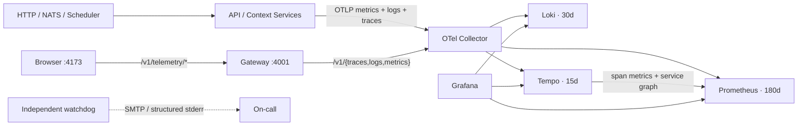
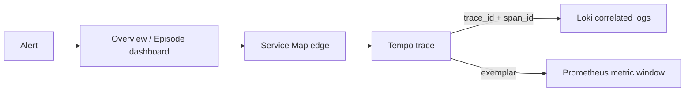

# Grafana Observability

OpenTelemetryを唯一の計装契約とし、Prometheus・Loki・TempoをGrafanaから横断する。UIで作った設定は正本にせず、データソース、ダッシュボード、アラート、通知経路をこのディレクトリでprovisioningする。



## ローカル起動

```bash
pnpm setup:env
pnpm dev:up:observed
```

完全再起動（volumeは保持）:

```bash
docker compose -f compose.yaml -f compose.observability.yaml down --remove-orphans
docker compose -f infra/observability/compose.yaml down --remove-orphans
pnpm dev:up:observed
pnpm observability:validate
pnpm observability:smoke
```

`compose.observability.yaml`はtelemetry設定だけを追加し、provider modeと資格情報を`.env`から継承する。`PROVIDER_MODE=live`では外部OpenAI API利用料金が発生し、`fake`では外部APIへ接続しない。`APP_ENV=production`では厳密な`live`と必須key/modelが揃わない構成をReady前に拒否する。BrowserのWeb Vitalは初期paintを取りこぼさないよう、SDKをアプリ描画前に開始する。

Prometheus、Loki、Tempo、Collector、Grafanaは`restart: unless-stopped`、期限付きstop、実endpointのhealthcheckを持つ。shellを含まない公式Loki/Tempo/Collector imageには、`Dockerfile.healthcheck`がdigest固定したstatic BusyBoxだけを追加し、application binaryや設定は変更しない。

GrafanaのDashboard JSONとprovisioning設定は、ホストcheckoutの`0600`/`0700`権限に依存しない。起動時にinit containerがnamed volumeへコピーし、ディレクトリを`0555`、ファイルを`0444`へ正規化する。Grafanaはそのvolumeをread-onlyでmountする。

| 接続先 | URL |
| --- | --- |
| Grafana | <http://localhost:3100> |
| Prometheus | <http://localhost:9090> |
| OTLP gRPC | `127.0.0.1:4317` |
| OTLP HTTP | `127.0.0.1:4318` |
| Collector metrics | <http://localhost:8888/metrics> |

Grafanaの初期ユーザーは`GRAFANA_ADMIN_USER`、passwordは`GRAFANA_ADMIN_PASSWORD`で指定する。未指定時のpasswordはローカル専用の`local-only-change-me`であり、本番では必ずsecretへ置換する。匿名アクセスは無効で、全ポートはローカルloopbackへbindする。

## CodexからGrafana MCPを使う

リポジトリ直下の`.codex/config.toml`がwrapperを介して、公式`grafana/mcp-grafana:1.0.0`を
Dockerの`stdio`として起動する。MCPコンテナは`news-podcast-observability` networkへ接続し、
Grafanaの内部サービス名`http://grafana:3000`だけを利用するため、MCP用の外部portは追加しない。

```bash
pnpm dev:up:observed
pnpm mcp:check
codex mcp list
codex mcp get grafana
```

ローカル起動はViewer Service Account/tokenを冪等作成し、有効な既存tokenを再利用する。失効時だけ
再発行し、tokenはgitignoredの`.codex/state/grafana-viewer-token`へ`0600`で保存する。wrapperは
`GRAFANA_SERVICE_ACCOUNT_TOKEN`を優先するため、本番は明示secretを使う。tokenなし、401、Grafana
未起動は原因別のエラーで停止する。管理者password、API key、tokenの実値はリポジトリや
`.env.example`へ保存しない。MCPはViewer、`--disable-write`、tool allowlistでread-onlyに固定する。

Tempo MCPは`tempo/config.yaml`で有効化し、GrafanaのTempo datasource proxy経由で
TraceQL検索とtrace取得を提供する。traceとlogの内容はLLMへ渡る可能性があるため、
機密情報をtelemetryへ記録しない。Tempo設定変更後はTempo/Grafanaを再起動し、stdio
MCPを再起動してtool一覧を再取得する。

## 調査フロー



すべてのサービス入口をserver/consumer span、外向き依存をclient/producer spanとして記録する。HTTPはW3C `traceparent`、NATSはmessage headerでcontextを伝播し、非同期consumerはenqueue spanへのlinkを保持する。ログは同じ`trace_id`と`span_id`を持つため、TempoからLokiへ、LokiからTempoへ移動できる。ユーザーID、認証header、cookie、完全URL、DB statement、message bodyはCollectorで削除する。

provisioningされるダッシュボード:

- `Overview`: RED指標、サービス別traffic/error/latency、警告ログ
- `Service Map & Tracing`: サービス依存、edge別RED、代表trace
- `Service Drilldown`: サービス/operation別RED、p95、exemplar、TraceQL、相関ログ
- `Correlated Logs`: level別volume、trace coverage、traceへ戻れるログ
- `Episode Production`: queue、worker state、stage/span、retry diagnostics、provider/client、storage、lease
- `Web Experience`: Browser span/error、Web Vital OTLP、Browser TraceQL、相関ログ
- `Dependencies`: service map、client/NATS/HTTP依存、依存先p95、相関ログ
- `Telemetry Platform`: Collector queue/export、backend、host resource

UIDとURLは次の通り。UIで作り直さず、`grafana/dashboards/*.json`を変更して再provisionする。

| Dashboard | URL |
| --- | --- |
| Overview | `/d/news-podcast-overview` |
| Service Map | `/d/news-podcast-service-map` |
| Service Drilldown | `/d/news-podcast-service-drilldown` |
| Correlated Logs | `/d/news-podcast-logs` |
| Episode Production | `/d/news-podcast-episode` |
| Web Experience | `/d/news-podcast-web` |
| Dependencies | `/d/news-podcast-dependencies` |
| Telemetry Platform | `/d/news-podcast-platform` |

## アラートと独立監視

Grafana Alertingはservice error/latency、API 5xx、episode failure/queue age、Collector export failure、未計装入口を1分ごとに評価する。SMTPは`GRAFANA_SMTP_*`で設定し、解消通知を含めて30分ごとに再通知する。

watchdogは通常Composeでも常駐する。Gateway、4 Context service、Web、NATS JetStream、SeaweedFS、VOICEVOXを監視し、observed構成ではGrafanaとCollectorも加える。SMTP一式が完全ならメール、未設定なら構造化stderrを正本とし、部分設定は起動エラーにする。`/health/live`と`/metrics`は対象別up、連続失敗、最終成功時刻を公開し、Prometheusは対象停止とwatchdog自体の消失をAlerting扱いにする。ホスト全停止とネットワーク全断を検知するには別ホストの外形監視を追加する。

## 本番OTLP ingress

443以外を外部公開せず、GrafanaはVPNまたはSSH tunnelから利用する。証明書を`/etc/letsencrypt/live/$OTLP_DOMAIN`へ配置してから、base構成へgateway overrideを重ねる。

```bash
GRAFANA_ADMIN_PASSWORD=... \
OTLP_DOMAIN=otel.example.com TELEMETRY_PROXY_TOKEN=... \
WATCHDOG_SMTP_HOST=... WATCHDOG_SMTP_USERNAME=... WATCHDOG_SMTP_PASSWORD=... \
WATCHDOG_SMTP_FROM=... WATCHDOG_SMTP_TO=... \
docker compose \
  -f infra/observability/compose.yaml \
  -f infra/observability/compose.gateway.yaml \
  up -d --wait
```

## 合格基準

1. 8ダッシュボード、9アラート、3データソースが起動時に自動生成される。
2. Prometheus、Loki、Tempoのhealth checkとCollectorの全exporterが成功する。
3. synthetic requestをサービス間で流し、service graph、trace、同一`trace_id`のログ、metric exemplarを辿れる。
4. CollectorまたはGrafanaを停止し、watchdogの障害通知と復旧通知を確認する。
5. metrics 180日、logs 30日、traces 15日のretentionとvolume backup/restoreを定期的に確認する。

設定の構文検証は各公式imageで行う。`pnpm observability:smoke`は毎回synthetic client/server traceを送信し、Dashboard UID、datasource health、Collector accepted/refused/export、service graph、Browser OTLP proxy、NATS/VOICEVOX/SeaweedFS endpointを自己完結して確認する。`OBSERVABILITY_TRACE_ID`を指定するとTempo trace、Loki同一trace_id、Prometheus span metric、同じtrace_idのexemplarも検証する。rollbackは直前commitの設定へ戻してComposeを再適用する。volumeは`docker compose down`では削除されない。
