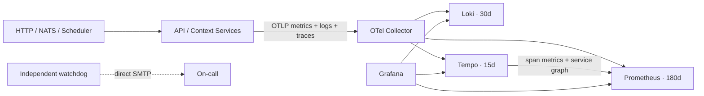
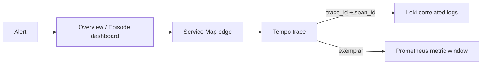

# Grafana Observability

OpenTelemetryを唯一の計装契約とし、Prometheus・Loki・TempoをGrafanaから横断する。UIで作った設定は正本にせず、データソース、ダッシュボード、アラート、通知経路をこのディレクトリでprovisioningする。



## ローカル起動

```bash
pnpm setup:env
pnpm dev:up:observed
```

| 接続先 | URL |
| --- | --- |
| Grafana | <http://localhost:3100> |
| Prometheus | <http://localhost:9090> |
| OTLP gRPC | `127.0.0.1:4317` |
| OTLP HTTP | `127.0.0.1:4318` |
| Collector metrics | <http://localhost:8888/metrics> |

Grafanaの初期ユーザーは`GRAFANA_ADMIN_USER`、passwordは`GRAFANA_ADMIN_PASSWORD`で指定する。未指定時のpasswordはローカル専用の`local-only-change-me`であり、本番では必ずsecretへ置換する。匿名アクセスは無効で、全ポートはローカルloopbackへbindする。

## 調査フロー



すべてのサービス入口をserver/consumer span、外向き依存をclient/producer spanとして記録する。HTTPはW3C `traceparent`、NATSはmessage headerでcontextを伝播し、非同期consumerはenqueue spanへのlinkを保持する。ログは同じ`trace_id`と`span_id`を持つため、TempoからLokiへ、LokiからTempoへ移動できる。ユーザーID、認証header、cookie、完全URL、DB statement、message bodyはCollectorで削除する。

provisioningされるダッシュボード:

- `Overview`: RED指標、サービス別traffic/error/latency、警告ログ
- `Service Map & Tracing`: サービス依存、edge別RED、代表trace
- `Correlated Logs`: level別volume、trace coverage、traceへ戻れるログ
- `Episode Production`: queue、stage、retry、provider、storage、lease
- `Telemetry Platform`: Collector queue/export、backend、host resource

## アラートと独立監視

Grafana Alertingはservice error/latency、API 5xx、episode failure/queue age、Collector export failure、未計装入口を1分ごとに評価する。SMTPは`GRAFANA_SMTP_*`で設定し、解消通知を含めて30分ごとに再通知する。

watchdogはGrafana経由ではなくSMTPへ直接通知する。API、Worker、VOICEVOX、Grafana、Collector exporter進捗を監視し、監視基盤そのものの停止も通知対象にする。ホスト全停止とネットワーク全断を検知するには別ホストの外形監視を追加する。

## 本番OTLP ingress

443以外を外部公開せず、GrafanaはVPNまたはSSH tunnelから利用する。証明書を`/etc/letsencrypt/live/$OTLP_DOMAIN`へ配置してから、base構成へgateway overrideを重ねる。

```bash
GRAFANA_ADMIN_PASSWORD=... \
OTLP_DOMAIN=otel.example.com TELEMETRY_PROXY_TOKEN=... \
WATCHDOG_SMTP_HOST=... WATCHDOG_SMTP_USERNAME=... WATCHDOG_SMTP_PASSWORD=... \
WATCHDOG_SMTP_FROM=... WATCHDOG_SMTP_TO=... \
docker compose \
  -f infra/observability/compose.yaml \
  -f infra/observability/compose.gateway.yaml \
  up -d --wait
```

## 合格基準

1. 5ダッシュボード、7アラート、3データソースが起動時に自動生成される。
2. Prometheus、Loki、Tempoのhealth checkとCollectorの全exporterが成功する。
3. synthetic requestをサービス間で流し、service graph、trace、同一`trace_id`のログ、metric exemplarを辿れる。
4. CollectorまたはGrafanaを停止し、watchdogの障害通知と復旧通知を確認する。
5. metrics 180日、logs 30日、traces 15日のretentionとvolume backup/restoreを定期的に確認する。

設定の構文検証は各公式imageで行い、Grafana APIでdatasource healthとprovisioning結果を確認する。rollbackは直前commitの設定へ戻してComposeを再適用する。volumeは`docker compose down`では削除されない。
