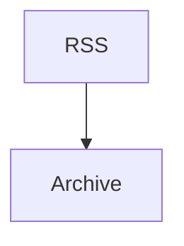

# Zennの記事構造を確かめる
- Source: https://zenn.dev/example/articles/fts5
Zenn固有のマークアップが正しくMarkdownへ落ちるかを確認します。

## ファイル名つきコードブロック

```sql title="migrations/0006_fts.sql"
CREATE VIRTUAL TABLE feed_items_fts USING fts5(title, body);
```

## ファイル名の無いコードブロック

```
pnpm vitest run
```

## メッセージボックス

> [!NOTE]
> trigramは辞書が不要です。

> [!WARNING]
> 索引サイズは3〜4倍に膨らみます。

## 折りたたみ

<details>
<summary>実測の詳細</summary>

3万件の日本語技術記事で計測しました。

</details>

## リンクカード

[https://example.com/real-article](https://example.com/real-article)

## Mermaid


